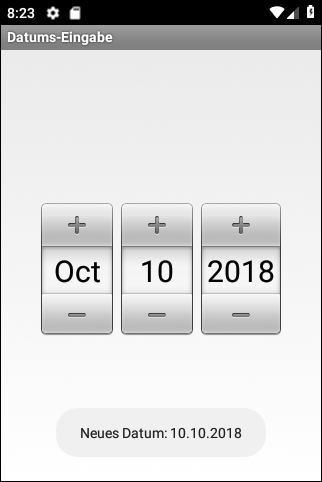
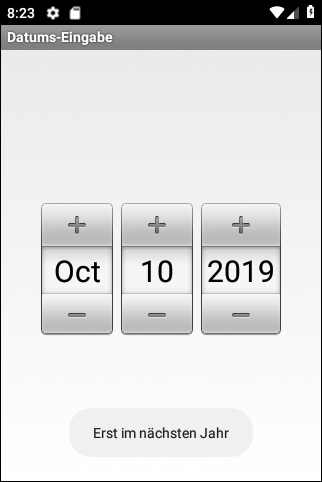

# Android-App "Datums-Eingabe"

Android app to demonstrate how to implement event handling for UI element [DatePicker](https://developer.android.com/reference/android/widget/DatePicker).

 

Identifiers (names for classes, variables and methods), UI texts and (JavaDoc) comments are in German only.

 

----
## Screenshots

  

 

----
# License

See the [LICENSE file](LICENSE.md) for license rights and limitations (BSD 3-Clause License).
